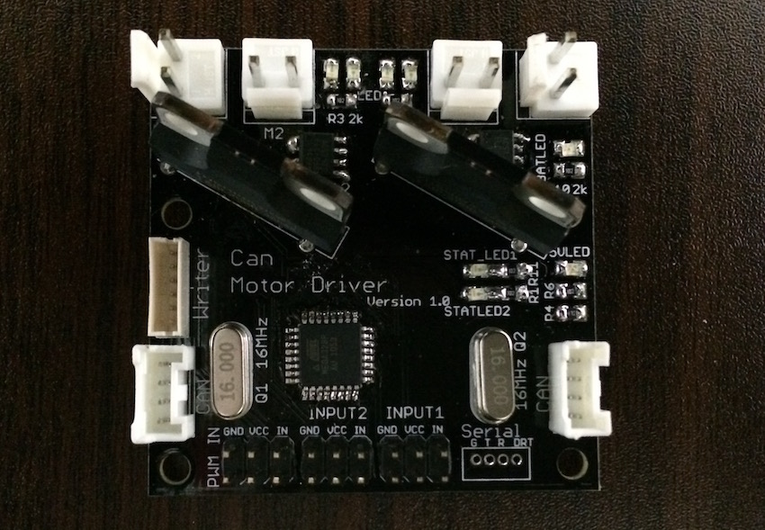

# CAN Motor Driver Board

can通信機能対応2chモータドライバ基板

## IO

- DCモータ2ch制御 avg3.0A,peek4.5A (TA8429H使用)(放熱してないので無理です..)
- モータ電源ポート2個
- CAN通信ポート2個
- avr ISP 書き込みポート
- Arduino書き込み対応シリアル通信ポート
- 汎用入出力4ch(内2chはプルダウン済み)
- アナログ入力2ch
- 状態表示用LED 2ch

## 製作動機

- 製作負担軽減（と個人的な趣好）のために既存のユニバーサル基板からプリント基板への移行したい
- 配線の簡略化、基板との双方向通信実現のためにCAN通信を導入したい

## 製作時の配慮
- ストックが多数あるTA8429Hを使う
- PWM入力に対応し、今までと同じ方法でも使用できるようにする
- Arduino開発環境に対応し、初心者でも扱いやすいように

## License

- MIT

## 使用ライブラリ等

- CAN_BUS_Shield : MIT : https://github.com/Seeed-Studio/CAN_BUS_Shield
- MsTimer2 : LGPL : http://playground.arduino.cc/Main/MsTimer2
- pins_arduino.h : LGPL
- Arduino-SerialCommand : ? : https://github.com/kroimon/Arduino-SerialCommand
